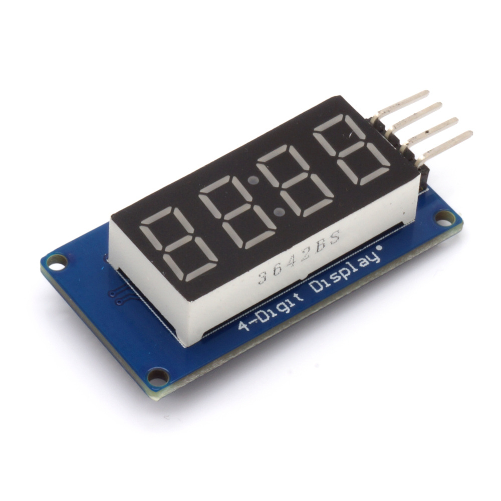

# tm1637.py

This code is designed for quad 7-segment LED display modules utilizing the TM1637 LED driver, and it operates without MicroPython or other microcontroller modules. This code is compatible with a standard Raspberry Pi (Zero and similar models).

For the original code and detailed documentation, please visit this [https://github.com/mcauser/micropython-tm1637](https://github.com/mcauser/micropython-tm1637).

